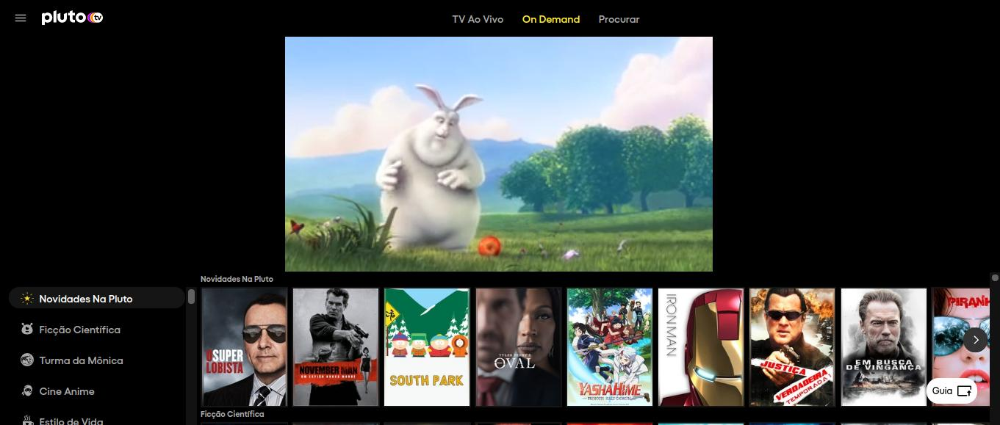

# Clone PlutoTv

This project is a study project. A clone of the On demand page of the pluto.tv website.



**Prerequisites:** Node.js [Node.js v14.17.3](https://nodejs.org/) e Angular CLI v12.1.4

## Installation

Clone the project
```
git clone https://github.com/danielrdesousa/plutoTv/
```
Install npm dependencies inside the project folder
```
cd plutoTv
npm install
```
Make sure you have angular-cli installed. I'll try to keep this project updated with the latest angular-cli version.
```
npm install -g angular-cli
npm install -g json-server
```

## Development server

Run `json-server --watch db.json` to simulate an API and `ng serve` for a dev server. Navigate to `http://localhost:4200/`. The app will automatically reload if you change any of the source files.


## Further help

To get more help on the Angular CLI use `ng help` or go check out the [Angular CLI Overview and Command Reference](https://angular.io/cli) page.


